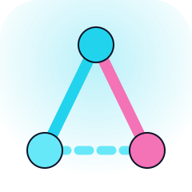
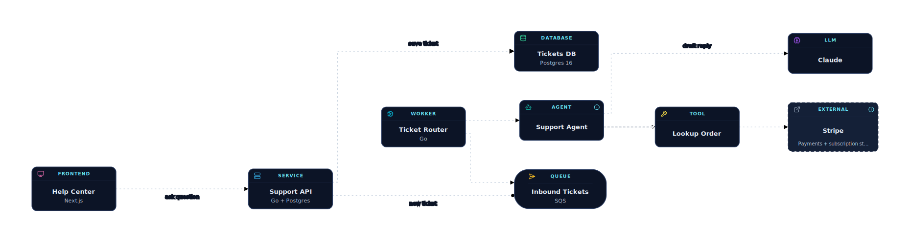

<p align="center">
  
</p>

<h1 align="center">archik</h1>

<p align="center">
  <em>The shared vocabulary between you and Claude Code, at the engineering level.</em>
</p>

[](https://www.npmjs.com/package/archik)
[](https://github.com/bacharSalleh/archik/actions/workflows/ci.yml)
[](https://github.com/bacharSalleh/archik/stargazers)
[](https://www.npmjs.com/package/archik)
[](./LICENSE)
[](https://nodejs.org)
[](https://x.com/bach__92)

<p align="center">
  
</p>

archik gives your project — and the AI editing it — *one file* that
describes what the system actually looks like. Services, databases,
queues, agents, LLMs, the edges between them. Plain YAML, schema-
validated, no coordinates, no proprietary format.

Open it in your browser for a live canvas. Render it in CI for a
self-contained SVG. Install the [Claude Code skill](#for-claude-code--other-llms)
so the model edits the same file you do — *the diagram and the
codebase stop drifting because Claude treats the diagram as the
spec*.

If you've ever asked an AI agent "where would I add X?" and watched
it guess from filenames, archik is the fix: the YAML answers the
question, and Claude is required to read it before doing structural
work.

## Quickstart

```bash
npx archik init       # scaffold .archik/main.archik.yaml in cwd
npx archik start      # canvas at http://localhost:5173 (background)
npx archik stop       # done
```

That's the whole onboarding. The canvas saves edits straight back to the YAML; the file is the truth, the canvas is a projection.

## What you write

```yaml
version: "1.0"
name: Support Hub
nodes:
  - id: api
    kind: service
    name: Support API
    stack: Go + Postgres
  - id: agent
    kind: agent
    name: Support Agent
    description: Drafts replies, escalates risky ones.
  - id: claude
    kind: llm
    name: Claude
edges:
  - id: api-agent
    from: api
    to: agent
    relationship: invokes
  - id: agent-claude
    from: agent
    to: claude
    relationship: invokes
    label: draft reply
```

No `x` / `y` / `width` — layout is computed by [ELK](https://eclipse.dev/elk/) on every render. The schema rejects coordinates so diffs stay meaningful.

## What it gives you

- **Live canvas** — `archik dev` (foreground) or `archik start` / `stop` (detached, multi-project).
- **27 node kinds** across compute, data, messaging, networking, hexagonal, AI/ML, identity, observability, cloud, UI, and external.
- **12 relationships** with distinct visual styling — `http_call`, `invokes`, `reads`, `writes`, `publishes`, `subscribes`, `streams_to`, `routes_to`, `implements`, `depends_on`, `has_a`, `uses`.
- **Drag-to-connect, multi-select, undo/redo, compact view, themed (dark / light), notes per node, color overrides on edges.**
- **CI-ready CLI** — `validate`, `render` (headless SVG), `watch`, `check` (drift between YAML and source dirs).
- **AI skill** — `archik skill --user` installs a Claude Code skill that teaches Claude the schema, the protocol, and the verification workflow.

## For Claude Code & other LLMs

The whole reason Archik uses YAML instead of a binary format: **the file is the shared map between you and the model**. Run:

```bash
archik skill --user        # install once into ~/.claude/skills
```

…and Claude Code in any project gets the right vocabulary automatically. The skill defines a 3-rule protocol:

1. **Read** `architecture.archik.yaml` before answering structural questions.
2. **Propose** YAML updates whenever new work introduces or rewires components.
3. **Run `archik validate`** after every edit to fail fast on schema errors.

So conversations like *"add a payments worker that subscribes to the orders queue"* end with both the code change **and** the matching YAML diff — kept in sync without anyone having to remember.

## Commands

```
archik init [path]       Scaffold a starter .archik/main.archik.yaml
                         (also installs the Claude skill by default)
                         --no-skill       skip installing the Claude skill

archik dev [path]        Open the canvas in your browser (foreground, Ctrl+C to stop)
archik start [path]      Same as dev, but detached — prompt returns immediately
archik stop [path]       Stop the background server started with `archik start`
archik status            List running archik instances across all projects
                         (dev / start share these flags)
                         --port <n>       dev server port (default 5173)
                         --host <addr>    bind address (default 127.0.0.1)
                         --no-open        don't auto-open the browser

archik validate [path]   Validate against the schema (CI-friendly, exit code 1 on error)
archik render [path]     Render to a self-contained SVG file
                         --out <file>     output path (default: diagram.svg)
                         --theme <name>   "dark" (default) or "light"
archik watch [path]      Re-render to SVG on every file change (Ctrl+C to stop)
archik check [path]      Drift detection — flag nodes without matching source dirs

archik skill             Install the Claude skill for AI editing
                         --user           install into ~/.claude/skills (all projects)
                         --force          overwrite an existing skill
```

Without a `[path]` argument, archik resolves the file in this order:

1. `.archik/main.archik.yaml` (preferred new convention — keeps the project root tidy)
2. `architecture.archik.yaml` (legacy root location — still fully supported)

If both exist the command errors out and asks you to pick one. New projects get the `.archik/` layout from `archik init`; existing projects keep working without any migration.

Single instance per file is enforced via a lock file in `$TMPDIR/archik-cli/`, so parallel `dev` and `start` against the same YAML are rejected with a friendly error.

## Use it in CI

```bash
# Fail the build on schema errors
archik validate

# Generate a committable SVG of your architecture for the docs site
archik render --theme light --out docs/architecture.svg

# Warn when nodes don't have a matching source folder under src/, services/, packages/, or apps/
archik check
```

## Schema

The full schema reference (every node kind, every relationship, common patterns, hard rules) lives in the AI skill. After installing it locally:

```bash
archik skill --user
$EDITOR ~/.claude/skills/archik/SKILL.md
```

Or read it directly in this repo: [`.claude/skills/archik/SKILL.md`](.claude/skills/archik/SKILL.md).

## Design notes

- The YAML is the only persistent truth. The canvas is a stateless projection that reloads on every file change (live-reload via SSE).
- Layout is non-negotiable: ELK lays out every render. Putting an `x` / `y` / `width` field at any level fails schema validation. No more "the diagram drifted because someone dragged a box."
- The published npm package ships only the bundled binary — no source files, no build tooling. Zero runtime dependencies.

## License

MIT © [Bashar](https://github.com/bacharSalleh)
